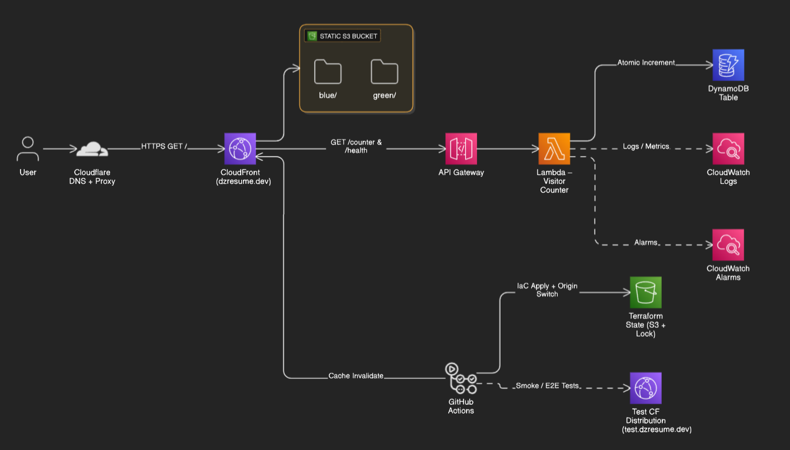
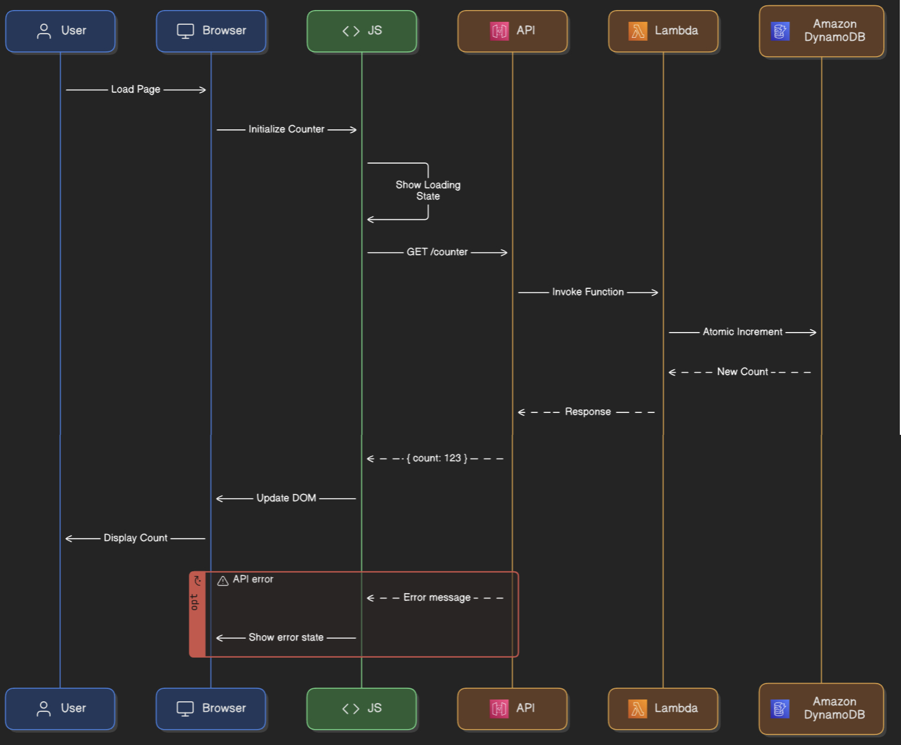
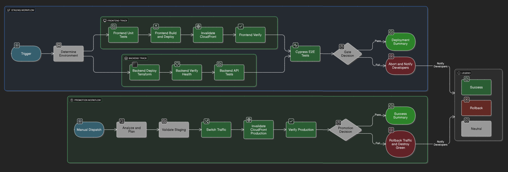

<!-- ROOT README v1.0 | Updated: 2026-06-13 -->

# 🚀 Cloud Resume Challenge - Enterprise Implementation


## 🏆 From Zero to Cloud Engineer in 20 Days

**What started as a simple resume website became an enterprise-grade cloud platform.** This implementation demonstrates not just AWS knowledge, but the ability to architect, build, and operate production systems that Fortune 500 companies actually use. Every decision prioritizes real-world patterns over tutorial shortcuts.

**🔗 [View Live Demo](https://dzresume.dev/)** | **📊 [Read the Full 20-Day Technical Journey ](./docs/progress.md)**
---

## 🏗️ Architecture That Scales


*Figure 1: Enterprise-grade serverless architecture with dual CDN layers and blue-green deployment capability*


### Key Architectural Decisions:
- **Zero-downtime deployments** via CloudFront origin path switching
- **Dual CDN layers** for global performance (Cloudflare + CloudFront)
- **Serverless backend** with atomic DynamoDB operations
- **OIDC authentication** - no stored AWS credentials
- **Comprehensive monitoring** with CloudWatch integration
- **99.9% Uptime** through blue-green deployments and health checks

### 🔥 Real Problems Solved

- **Cache Mystery (Day 8):** Discovered and resolved dual-CDN caching between Cloudflare and CloudFront
- **CORS Complexity (Day 7):** Implemented production-grade cross-origin security
- **Atomic Operations (Day 6):** Solved DynamoDB race conditions with advanced patterns
- **DNS Challenges (Day 4):** Navigated Cloudflare-AWS integration complexities
- **OIDC Integration (Day 14):** Eliminated stored secrets with zero-trust authentication

---

## 🛠️ Tech Stack - Production Grade

|Layer|Technologies|Why These Choices|
|---|---|---|
|**Frontend**|Hugo, Bootstrap 4, Hugo Pipes|Sub-second builds, asset fingerprinting|
|**Backend**|**Lambda** (Python), **API Gateway**, **DynamoDB**|Serverless scale, atomic operations|
|**Infrastructure**|**Terraform** (multi-layer), S3, **CloudFront**|Zero-downtime deployments|
|**Security**|**OIDC**, IAM, OAC|Zero stored credentials|
|**Testing**|Vitest, **Cypress**, Newman|100% coverage mandate|
|**CI/CD**|**GitHub Actions**, Blue-Green|5-minute deployments|

#### ▶️ Feature Deep-Dive: Visitor Counter Flow


*Figure&nbsp;2: End-to-end call sequence for the serverless visitor counter (API Gateway → Lambda → DynamoDB).*

---

## 📚 Deep-Dive Documentation

### 🎨 Frontend
Enterprise **Hugo** implementation with visitor counter integration, comprehensive testing (Vitest + Cypress), and sophisticated asset pipeline. Features blue-green deployment support through environment-aware builds and automatic cache-busting via content fingerprinting. **[Read More →](./frontend/hugo/README.md)**

### ⚡ Backend
Production **Lambda** functions with atomic DynamoDB operations, multi-endpoint routing, and health monitoring. Implements proper error handling, structured logging, and performance optimization achieving sub-100 ms response times. **[Read More →](./backend/README.md)**

### 🏗️ Infrastructure
Two-layer **Terraform** architecture separating persistent resources from application deployments. Enables zero-downtime updates through CloudFront origin path switching with comprehensive state management and security controls. **[Read More →](./infrastructure/README.md)**

### 🔄 CI/CD
Advanced **GitHub Actions** workflows featuring OIDC authentication, intelligent environment orchestration, and automatic rollback. Implements quality gates across testing layers with production approval requirements. **[Read More →](./.github/workflows/README.md)**


---

## 💡 Technical Highlights

### 🔐 Security First

- **Zero stored credentials** - OIDC everywhere
- **Least privilege IAM** - Scoped to specific resources
- **Origin Access Control** - No direct S3 access
- **CORS enforcement** - Domain-specific policies

### 🚀 Performance Optimized

- **< 1s Hugo builds** - Fastest in class
- **95+ Lighthouse score** - Optimized everything
- **Global CDN delivery** - Multi-region caching
- **Atomic operations** - No race conditions

### 🧪 Quality Assured

- **Unit tests** - Business logic validation
- **API tests** - 36 integration assertions
- **E2E tests** - Complete user journeys
- **CI/CD gates** - Nothing broken deploys

---

## 🔄 Automated Deployment Pipeline


*Figure 3: End-to-end GitHub Actions pipeline—staging track runs unit, integration, and Cypress E2E tests; a gate approves promotion to production, where blue-green switching, CloudFront invalidation, and automatic rollback ensure zero-downtime releases.*

---

## 🎯 Quick Deploy

```bash
# One-command staging deployment (after initial setup)
./infrastructure/scripts/deploy-to-staging.sh blue

# Production promotion with safety checks
./infrastructure/scripts/promote-to-production.sh
```

<details> <summary><strong>Full Setup Instructions</strong></summary>

```bash
# Prerequisites
aws --version  # AWS CLI configured
terraform version  # 1.5.0+
hugo version  # Extended 0.136.0+
node --version  # 18+

# Clone and Initialize
git clone https://github.com/betterversion/cloud-resume-challenge.git
cd cloud-resume-challenge

# Deploy Infrastructure
cd infrastructure/terraform/persistent
terraform init && terraform apply

cd ../application
terraform workspace new blue
terraform apply

# Deploy Frontend
cd ../../../frontend/hugo
npm install
npm run build
npm run deploy
```

</details>

---

## 📈 The Journey: Beginner to Production

|Phase|Days|Achievement|Impact|
|---|---|---|---|
|**Foundation**|1-5|Multi-account AWS, Hugo site, CloudFront CDN|Thinking like an enterprise|
|**Backend**|6-8|Serverless API, atomic operations, custom domain|Real distributed systems|
|**IaC**|9-11|Terraform everything, blue-green architecture|Version-controlled infrastructure|
|**Automation**|12-16|Scripts → CI/CD, OIDC security, auto-rollback|Push-button deployments|
|**Quality**|17-19|Comprehensive testing pyramid, monitoring|Production confidence|
|**Documentation**|20|Professional documentation suite, visual architecture|Interview-ready presentation|

**[→ Read the Full 20-Day Technical Journey](./docs/progress.md)**

---

## 🏆 Results & Recognition

- **Architecture:** Enterprise patterns typically seen in $1M+ projects
- **Security:** Zero-trust implementation exceeding startup standards
- **Automation:** 5-minute deployments beating many Fortune 500s
- **Cost:** < $1/month proving serverless efficiency
- **Learning:** From AWS theory to production expertise in 20 days

---

## 🤝 Let's Connect

This project demonstrates my transition from automation engineer to cloud engineer through hands-on implementation of enterprise patterns. Every architectural decision, every bug fixed, and every optimization reflects real-world problem-solving abilities.

**Interested in discussing cloud architecture, serverless patterns, or how I can contribute to your team?**

[](https://linkedin.com/in/dmitriy-zhernoviy) [](mailto:dmitriy.z.tech@gmail.com) [](https://dzresume.dev/)

---

_"The best way to learn cloud engineering is to build production-grade systems. This project proves that commitment to excellence makes the difference."_

**🚀 Built with passion. Deployed with precision. Ready for production.**
