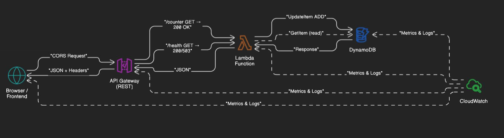

<!-- BACKEND README v1.1 | Updated: 2025-06-12 -->
[← Back to Root Overview](../README.md)

# 🛠️ Backend - Serverless API Infrastructure

**Enterprise-grade serverless backend with atomic operations and zero-downtime deployment.**

**Production-grade serverless backend** powering the visitor counter with atomic operations, comprehensive monitoring, and zero-downtime deployment support. Built with Python Lambda, API Gateway, and DynamoDB for enterprise-scale reliability.

---

## 📐 Serverless Architecture


*Figure 1: Serverless backend architecture with atomic operations and comprehensive monitoring*

### Request Flow Sequence

*Figure 2: End-to-end request lifecycle with error handling*

**Request Lifecycle:**

- **API Gateway** validates request, applies CORS, enforces rate limits
- **Lambda** routes by path, handles business logic with atomic operations
- **DynamoDB** processes conditional writes and consistent reads
- **Response** includes structured JSON with correlation IDs
- **Monitoring** captures metrics across all components

---

## ⚙️ Tech Stack

|Component|Technology|Purpose|
|---|---|---|
|**Runtime**|Python 3.11|Lambda execution environment|
|**API Layer**|**API Gateway** REST|HTTP routing and security|
|**Database**|**DynamoDB**|Atomic counter operations|
|**Testing**|**Postman** + **Newman**|36 comprehensive assertions|
|**Deployment**|**Terraform** + **GitHub Actions**|Infrastructure as Code|

---

## 🧩 Lambda Flow & boto3 Calls

**Environment Variables:**

- `TABLE_NAME` - DynamoDB table identifier
- `STAGE` - Deployment environment (blue/green)

**Execution Flow:**

1. **Parse Event** - Extract path, method, headers from API Gateway
2. **Route Request** - Direct to `/counter` or `/health` handler
3. **Database Operation** - Execute atomic `UpdateItem` with `ADD` expression
4. **CORS Processing** - Apply origin-specific headers
5. **Response Formation** - Structure JSON with request correlation
6. **Error Handling** - Sanitize errors, log context, return user-safe messages

```python
# Atomic counter increment with boto3
response = table.update_item(
    Key={'counter_id': 'main_counter'},
    UpdateExpression='ADD visit_count :increment SET last_updated = :timestamp',
    ExpressionAttributeValues={
        ':increment': 1,
        ':timestamp': datetime.now().isoformat()
    },
    ReturnValues='UPDATED_NEW'
)
new_count = int(response['Attributes']['visit_count'])
```

---

## 🚀 Quick Start

### Prerequisites

- **AWS CLI** configured with appropriate permissions
- **Docker** for Newman test execution

### Local Testing

```bash
# Test API endpoints directly
curl https://api.dzresume.dev/counter
curl https://api.dzresume.dev/health

# Run comprehensive test suite
cd backend
./scripts/run-api-tests.sh blue
```

### Lambda Invocation

```bash
# Direct Lambda invoke
aws lambda invoke \
  --function-name resume-blue-visitor-counter \
  --payload '{"path": "/counter", "httpMethod": "GET"}' \
  response.json
```

---

## 🧪 Testing

**Multi-layer validation** with 36 automated assertions across functionality, performance, and security.

### Test Execution

```bash
# Run all tests for environment
./scripts/run-api-tests.sh [blue|green]

# Manual Newman execution
docker run --rm -v $(pwd)/tests:/etc/newman postman/newman:latest \
  run collections/api-tests.json -e environments/blue.json
```

### Test Categories

- **Functional:** Counter increment, health checks, error handling
- **Performance:** Response times, cold start detection
- **Security:** CORS validation, header inspection
- **Integration:** Cross-endpoint consistency

---

## 🔄 CI/CD Workflow

**Automated deployment** with comprehensive validation gates.

```bash
# Staging deployment (auto-triggered)
git push origin main

# Production promotion (manual approval)
GitHub Actions → Staging Success → Manual Approval → Production
```

**Pipeline Stages:**

1. **Deploy Backend** - Infrastructure provisioning
2. **API Validation** - 36-assertion test suite
3. **Health Verification** - Endpoint connectivity
4. **Promotion Gate** - Manual approval for production

See [CI/CD Documentation](./../.github/workflows/README.md) for detailed workflow architecture.

---

## 📈 API Reference

|Endpoint|Method|Success|Error|
|---|---|---|---|
|`/counter`|GET|200 OK|500 Internal Server Error|
|`/health`|GET|200 OK|503 Service Unavailable|
|`/*`|ANY|403 Forbidden|403 Forbidden|

### `GET /counter` - Visitor Counter

**Purpose:** Atomically increment and return visitor count

```json
{
  "count": 123,
  "timestamp": "2024-01-15T10:30:00Z",
  "status": "success",
  "requestId": "abc123-def456-ghi789"
}
```

### `GET /health` - Health Check

**Purpose:** Validate service and database connectivity

```json
{
  "status": "healthy",
  "service": "visitor-counter",
  "database": "connected",
  "counter_value": 123,
  "timestamp": "2024-01-15T10:30:00Z"
}
```

<details> <summary><strong>Error Response Examples</strong></summary>

**400 Bad Request** (API Gateway):

```json
{
  "message": "Missing Authentication Token"
}
```

**500 Internal Server Error** (Lambda):

```json
{
  "status": "error",
  "message": "Unable to process request. Please try again.",
  "requestId": "abc123-def456-ghi789"
}
```

**503 Service Unavailable** (Health Check):

```json
{
  "status": "unhealthy",
  "service": "visitor-counter",
  "database": "error",
  "error": "Connection timeout",
  "timestamp": "2024-01-15T10:30:00Z"
}
```

</details>

---

## 🗄️ Data Model

### DynamoDB Schema

```json
{
  "TableName": "visitor-counter-prod",
  "KeySchema": [
    {"AttributeName": "counter_id", "KeyType": "HASH"}
  ],
  "BillingMode": "ON_DEMAND"
}
```

### Record Structure

```json
{
  "counter_id": "main_counter",
  "visit_count": 123,
  "created_date": "2024-01-15T10:00:00Z",
  "last_updated": "2024-01-15T10:30:00Z",
  "ItemExpireTTL": 1706097600
}
```

**TTL Configuration:** `ItemExpireTTL` attribute enables 30-day automatic record purge for compliance and cost optimization.

**Operations:**

- **Atomic Increment** - `ADD visit_count :increment`
- **Conditional Create** - `attribute_not_exists(counter_id)`
- **Health Queries** - `GetItem` for non-destructive reads

---

## 🔒 Security Notes

### IAM Permissions

```json
{
  "Effect": "Allow",
  "Action": [
    "dynamodb:GetItem",
    "dynamodb:UpdateItem",
    "dynamodb:PutItem"
  ],
  "Resource": "arn:aws:dynamodb:us-east-1:*:table/visitor-counter-prod"
}
```

### CORS Configuration

- **Production:** `https://www.dzresume.dev`, `https://dzresume.dev`
- **Development:** `http://localhost:1580`, `http://127.0.0.1:1580`
- **Staging:** `https://test.dzresume.dev`

### Input Validation

- **Path-based routing** with explicit endpoint mapping
- **Request correlation** via AWS request IDs
- **Error sanitization** - no sensitive data in user responses
- **Rate limiting** via **API Gateway** usage plans

---

_Serverless backend demonstrating enterprise patterns with atomic operations and comprehensive monitoring 🚀_
