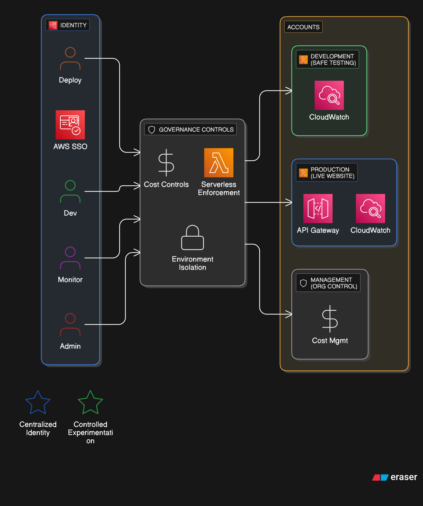
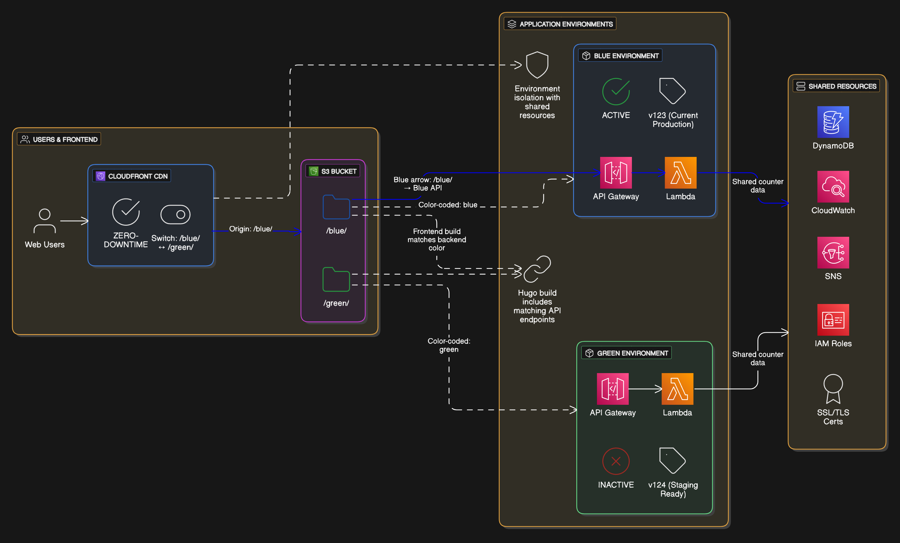

[← Back to Root Overview](../README.md)

<!-- TERRAFORM README v1.0 | Updated: 2025-06-12 -->

# 🏗️ Infrastructure as Code - Terraform Implementation

**Enterprise-grade two-layer Terraform architecture enabling zero-downtime blue-green deployments for serverless resume application.**

Professional **Infrastructure as Code** supporting the [serverless backend](../backend/README.md) and [Hugo frontend](../frontend/hugo/README.md) with advanced deployment patterns, comprehensive monitoring, and production-ready security controls.

---
## 📑 Table of Contents
- [🚀 Infrastructure Overview](#-infrastructure-overview)
- [🗂️ Module Layout](#-module-layout)
- [🔄 State Management](#-state-management)
- [🟢 Blue-Green Deployment Flow](#-blue-green-deployment-flow)
- [📊 Key Variables & Outputs](#-key-variables--outputs)
- [🔑 Core Resources & Rationale](#-core-resources--rationale)
- [🛠️ Quick Start](#-quick-start)
- [💸 Cost & Governance](#-cost--governance)
- [🔒 Security & Compliance](#-security--compliance)


<h2 id="infrastructure-overview">🚀 Infrastructure Overview</h2>

### Enterprise Multi-Account Architecture

*Figure 1: AWS Organizations setup with SSO identity management, governance controls, and cost management*

### Blue-Green Deployment Architecture

*Figure 2: Zero-downtime deployment flow with persistent and application layer separation*

**Architecture Benefits:**

- **Zero-downtime deployments** via CloudFront origin path switching
- **Environment isolation** through Terraform workspaces
- **Infrastructure versioning** with remote state management
- **Cost optimization** with on-demand scaling and lifecycle policies
- **Security hardening** via least-privilege IAM and OAC controls

---

<h2 id="module-layout">🗂️ Module Layout</h2>

```
infrastructure/terraform/
├── persistent/          # Shared foundation layer
│   ├── s3.tf           # Website hosting + state bucket
│   ├── cloudfront.tf   # CDN with blue-green origin paths
│   ├── dynamodb.tf     # Visitor counter database
│   ├── acm.tf          # SSL certificates (*.dzresume.dev)
│   ├── iam-lambda.tf   # Lambda execution roles
│   ├── iam-github-actions.tf  # OIDC deployment roles
│   └── outputs.tf      # 50+ outputs for application layer
│   • Key outputs: CloudFront distribution IDs, S3 bucket ARNs, IAM role ARNs
└── application/         # Environment-specific resources
    ├── lambda.tf        # Visitor counter function
    ├── api-gateway.tf   # REST API with CORS
    ├── monitoring.tf    # CloudWatch dashboards + alarms
    └── outputs.tf       # Deployment endpoints + commands
    • Key outputs: API Gateway URLs, Lambda function names, test commands
```

**Layer Responsibilities:**

- **Persistent:** Long-lived infrastructure shared across environments
- **Application:** Short-lived resources deployed per workspace (blue/green)

---

<h2 id="state-management">🔄 State Management</h2>

### Remote Backend Configuration

```hcl
terraform {
  backend "s3" {
    bucket = "crc-terraform-state-prod"
    key    = "persistent/default.tfstate"  # or application/terraform.tfstate
    region = "us-east-1"
    encrypt = true
    dynamodb_table = "terraform-state-lock"
  }
}
```

### Workspace Strategy

**Persistent Layer:** Single `default` workspace managing shared resources

**Application Layer:** Dual workspaces enabling parallel environments

```bash
# Blue environment
terraform workspace select blue
terraform apply

# Green environment
terraform workspace select green
terraform apply

# List all workspaces
terraform workspace list

# Cleanup unused workspaces
terraform workspace delete old-environment
```

**State Isolation:** Each workspace maintains independent `.tfstate` files preventing resource conflicts during deployments.

**Lock Management:** **DynamoDB** state locking prevents concurrent modifications with IAM permissions for lock table access.

---

<h2 id="blue-green-deployment-flow">🟢 Blue-Green Deployment Flow</h2>

### Traffic Switching Mechanism

**CloudFront Origin Paths** provide zero-downtime switching:

```hcl
origin_path = "/${var.active_environment}"  # /blue or /green
```

### Deployment Sequence

1. **Deploy to Inactive** - Update green environment while blue serves traffic
2. **Validation** - Comprehensive testing via `test.dzresume.dev` subdomain
3. **Traffic Switch** - Update `active_environment` variable in persistent layer
4. **Verification** - Confirm production functionality
5. **Cleanup** - Optionally destroy previous environment

### Zero-Downtime Benefits

- **Instant rollback** by reverting `active_environment` variable
- **A/B testing** capability through traffic splitting
- **Blue environment** always available as fallback
- **Database consistency** via shared DynamoDB table

---

<h2 id="key-variables-outputs">📊 Key Variables & Outputs</h2>

### Persistent Layer Variables

|Name|Type|Default|Description|
|---|---|---|---|
|`active_environment`|string|`"blue"`|Currently active environment (blue/green)|
|`aws_profile`|string|`""`|AWS profile for local development|
|`domain_name`|string|`"dzresume.dev"`|Primary domain for SSL certificates|
|`alert_email`|string|`"dmitriy.z.tech@gmail.com"`|CloudWatch alarm notifications|

### Application Layer Variables

|Name|Type|Default|Description|
|---|---|---|---|
|`project_name`|string|`"resume"`|Resource naming prefix|
|`log_retention_days`|number|`7`|CloudWatch log retention period|

### Critical Outputs

- **Remote State Integration:** `lambda_execution_role_arn`, `dynamodb_table_name`
- **Deployment Commands:** `website_sync_blue_command`, `cache_invalidation_command`
- **Console Links:** Direct AWS console URLs for operational access

---

<h2 id="core-resources-rationale">🔑 Core Resources & Rationale</h2>

### **S3** - Multi-Purpose Storage

- **Website Hosting:** Static Hugo content with blue-green folder structure
- **Access Logs:** CloudFront request analytics and debugging
- **State Management:** Terraform backend with versioning and encryption

### **CloudFront** - Global Content Delivery

- **Performance:** Sub-100ms response times via edge caching
- **Security:** Origin Access Control prevents direct S3 access
- **Blue-Green:** Dynamic origin paths enable instant traffic switching

### **DynamoDB** - Serverless Database

- **Atomic Operations:** Visitor counter with consistent increments
- **Auto-Scaling:** On-demand billing handles traffic spikes
- **Point-in-Time Recovery:** Data protection for compliance requirements

### **Lambda** - Serverless Computing

- **Multi-Endpoint:** Single function handles `/counter` and `/health` routes
- **Environment Isolation:** Workspace-based function naming prevents conflicts
- **Performance Optimization:** Connection pooling and proper memory allocation

### **API Gateway** - HTTP Interface

- **CORS Configuration:** Cross-origin support for frontend integration
- **Rate Limiting:** Protection against abuse and cost management
- **Custom Domains:** Professional branding via `api.dzresume.dev`

### **CloudWatch** - Observability Stack

- **Comprehensive Monitoring:** Lambda errors, API latency, database throttling
- **Business Metrics:** Visitor patterns and growth trend analysis
- **Automated Alerting:** SNS integration for operational notifications

_See [Backend Documentation](../backend/README.md) for API specifications and [Frontend Documentation](../frontend/hugo/README.md) for Hugo integration details._

---

<h2 id="quick-start">🛠️ Quick Start</h2>

### Prerequisites

```bash
# Install Terraform version manager
brew install tfenv
tfenv install 1.5.0
tfenv use 1.5.0

# Configure AWS authentication
aws configure sso
export AWS_PROFILE=your-profile
```

### Deployment Workflow

```bash
# 1. Initialize persistent layer
cd infrastructure/terraform/persistent
terraform init
terraform plan
terraform apply

# 2. Deploy application (blue environment)
cd ../application
terraform init
terraform workspace new blue
terraform plan
terraform apply

# 3. Deploy application (green environment)
terraform workspace new green
terraform apply

# 4. Switch traffic (persistent layer)
cd ../persistent
terraform apply -var="active_environment=green"

# 5. Invalidate CloudFront cache after traffic switch
aws cloudfront create-invalidation --distribution-id DISTRIBUTION_ID --paths "/*"
```

### Destroy Operations

```bash
# Destroy specific workspace
terraform workspace select blue
terraform destroy -var="confirm_destroy=true"

# Destroy persistent layer (requires all application workspaces destroyed first)
cd ../persistent
terraform destroy -var="confirm_destroy=true"
```

---


<h2 id="cost-governance">💸 Cost & Governance</h2>

### Tagging Standards

|Tag|Purpose|Example|
|---|---|---|
|`Project`|Cost allocation|`CloudResumeChallenge`|
|`Environment`|Lifecycle management|`Production`|
|`ManagedBy`|Automation tracking|`terraform`|
|`Owner`|Operational responsibility|`dmitriy.z.tech@gmail.com`|

### Cost Controls

- **AWS Budgets:** $20 monthly alert threshold
- **Anomaly Detection:** Automated unusual spending notifications
- **Resource Lifecycle:** Automatic log retention and cleanup policies
- **On-Demand Scaling:** DynamoDB and Lambda eliminate idle costs

---

<h2 id="security-compliance">🔒 Security & Compliance</h2>

### Access Controls

- **OIDC Authentication:** GitHub Actions uses temporary credentials only
- **Least Privilege IAM:** Scoped permissions per service requirement
- **State Encryption:** S3 backend with server-side encryption
- **Resource Isolation:** Blue-green environments prevent cross-contamination

### Data Protection

- **SSL/TLS Everywhere:** ACM certificates with automatic renewal
- **Origin Access Control:** CloudFront OAC replaces legacy OAI
- **Network Security:** VPC-less architecture eliminates network attack surface
- **Audit Logging:** CloudTrail integration for compliance requirements

### Compliance Features

- **Point-in-Time Recovery:** DynamoDB backup capabilities
- **Versioned State:** Complete infrastructure change history
- **Immutable Deployments:** Infrastructure replacements vs. modifications
- **Automated Security:** **tfsec** and **Checkov** policy enforcement

---

_Infrastructure as Code demonstrating enterprise patterns with zero-downtime deployment capabilities 🚀_
